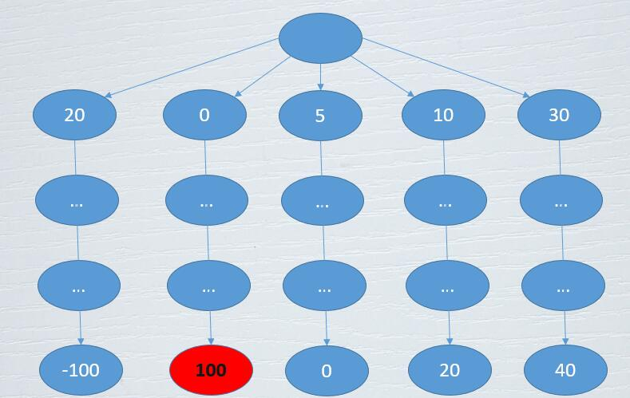
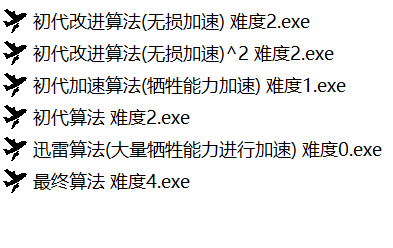

# Connect6

* 图形界面基于EasyX开发。EasyX下载地址：https://easyx.cn/

* 贪心算法是主要算法。选择若干个分数最高的节点，然后对每个节点轮流进行若干次贪心落子。最后选择每个节点模拟落子结束后分数最高的节点。

可执行文件放在Connect6文件夹下，源代码在SunSpot文件夹下。提供了多个AI, 在Plugin.cpp文件中修改Plugin函数的参数就能改变AI。

AI说明：

初代算法：对应Plugin.cpp中的Greedy函数。采用全局扫描贪心算法。

初代改进算法(无损加速)：对应Plugin.cpp中的GreedyPlus函数。在初代算法的基础上改进了估值函数的				计算方式，速度更快，但能力一样。

初代算法(无损加速^2)：对应Plugin.cpp中的GreedyPlus函数(需要把GreedyPlus中的估值函数换成GetScorePart)。在初代算法(无损加速)的基础上把全局扫描估值换成局部扫描估值的计算方式，速度更快，但能力一样。

初代算法(牺牲能力加速)：对应Plugin.cpp中的GreedyPlusCut函数。在初代算法(无损加速)的基础上先选择若干个分数最高的节点，再拿这些节点与其他可以落子的地方进行匹配，选择匹配分数最高的。

初代算法(大量牺牲能力加速)：对应Plugin.cpp中的GreedyPlusTwo函数。分两次落子，每次都选择分数最高的位置。

最终算法：对应Plugin.cpp中的GreedyPlusMax函数。具体思路见上方。

